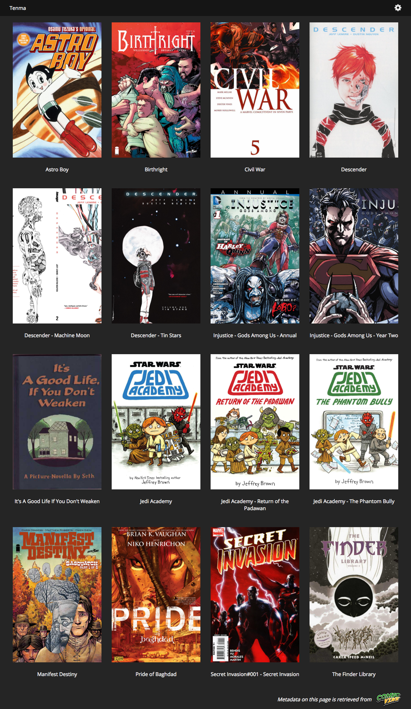
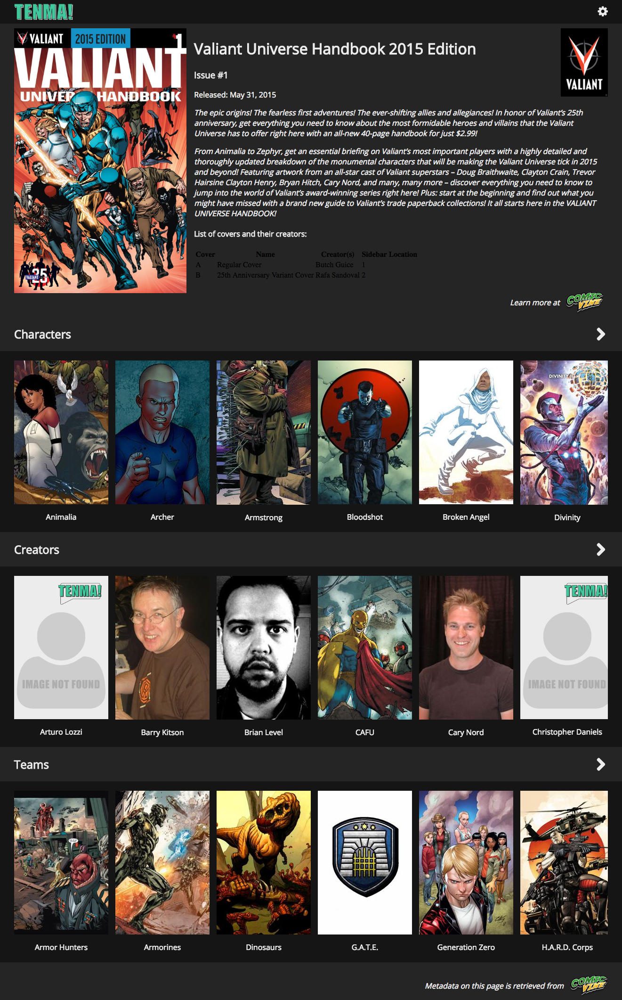

**Tenma is currently in alpha. I can not claim that this application is secure to run over the internet.**

Tenma is a self-hosted server that allows you to store, organize, and read DRM-free digital comic books. Tenma leverages the [ComicVine](http://comicvine.gamespot.com) [API](http://comicvine.gamespot.com/api) to retrieve metadata for your comics that will show how your different comics are related (ComicVine account required for this optional feature).

### Features ###

* Read your DRM-free digital comic books from any device that has a browser.
* See how your comics are connected by characters, creators, teams, story arcs and publishers.
* Live search through all of your series.
* Two view modes. Fit the comic horizontally or vertically to your browser window.
* Comic navigation with arrow buttons, or with your keyboard's arrow keys.
* Supports CBZ, ZIP, CBR, RAR, CBT and TAR formats.
* ... More features on the way!

# Where to get DRM-free comics #

**Please don't pirate your digital comics!**

You can legally download DRM-free comics from the following sources:

- [**Comixology**](https://www.comixology.com/drm-free-backup): Allows you to download your comics (depends on the publisher). They also have a number of [free comics](https://www.comixology.com/free-comics).
- [**Image Comics**](https://imagecomics.com/): This publisher sells their own comics, DRM-free, on their site.
- [**Humble Bundle**](https://www.humblebundle.com/books): Humble Bundle will occasionally feature digital comics in their books section. It's definitely worth checking once in awhile.
- [**Drive Thru Comics**](http://drivethrucomics.com/): Sells DRM-free digital comic books.

**NOTE:** When purchasing, keep in mind that PDF is currently an unsupported format. This will hopefully change in the near future.

# Installation and Configuration #

For Docker installation check out the [tenma-docker](https://github.com/hmhrex/tenma-docker) repo.

To manually install, please refer to the [Tenma Wiki](https://github.com/hmhrex/Tenma/wiki) for installation and configuration instructions for different operating systems.

# Screenshots #

#### Homepage ####

#### Issue Page ####

*For more screenshots, check out the screenshots directory*

# Contributing #
If you'd like to contribute, please create an issue and a related PR.
